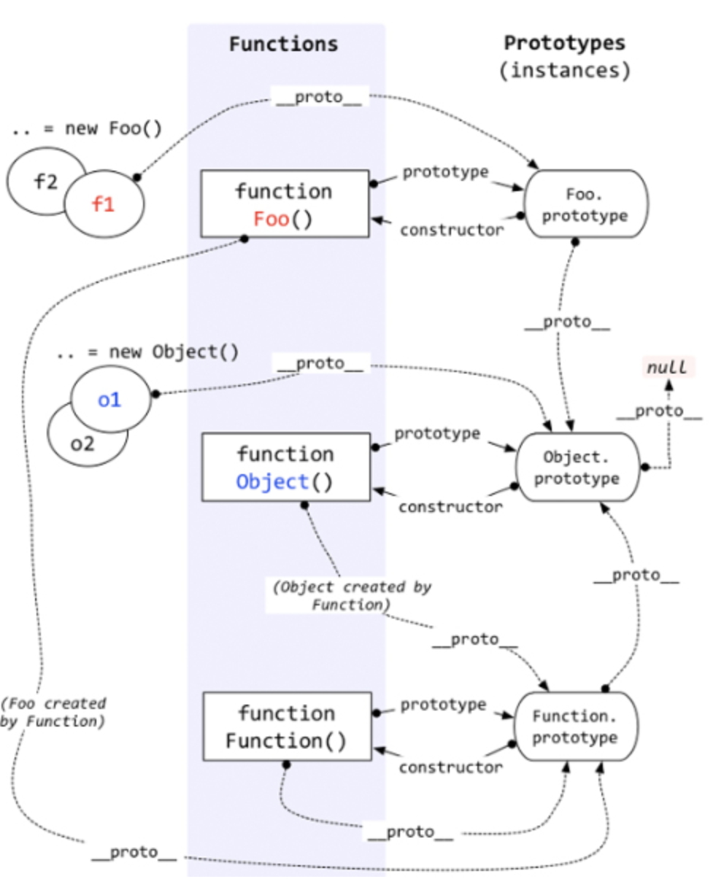
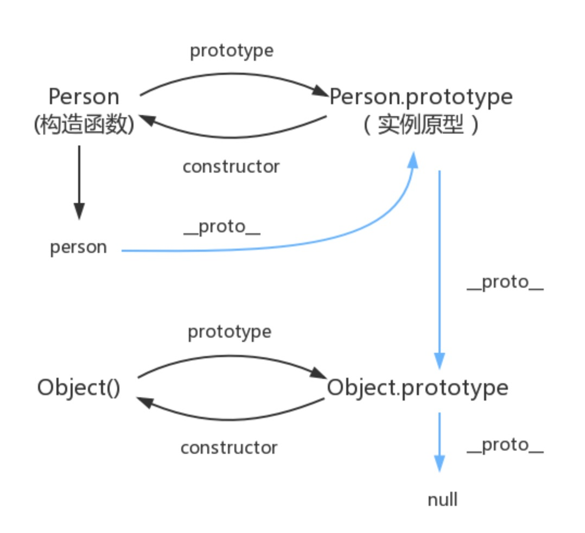

##### 什么是原型
###### prototype 
每一个JavaScript对象(null除外)在创建的时候就会与之关联另一个对象，这个对象就是我们所说的原型，每一个对象都会从原型"继承"属性。
函数的 prototype 属性指向了一个对象，这个对象正是调用该构造函数而创建的实例的原型.
###### ```__proto__```
这是每一个JavaScript对象(除了 null )都具有的一个属性，叫__proto__，这个属性会指向该对象的原型.

```
<!--使用构造函数创建一个对象-->
function People() {}
const people = new People()
console.log(people.__proto__ === People.prototype) 
// true
```
实例的__proto__属性指向构造函数的原型
###### constructor
原型的constructor属性指向构造函数、
```
People === People.prototype.constructor 
// true
```
##### 实例与原型
当读取实例的属性时，如果找不到，就会查找与对象关联的原型中的属性，如果还查不到，就去找原型的原型，一直找到最顶层为止。
```
People.prototype.name = 'hemei'
people.name = 'ahhhh'
console.log(people.name)

delete people.name
console.log(people.name)
```
##### 原型的原型
原型对象就是通过 Object 构造函数生成的
```
Peopel.prototype.__proto__ -> Object.prototype
Object.prototype.constractor -> Object()
Object.protptype.__proto__ === null // true
```
###### instanceof 表示的就是一种继承关系，或者原型链的结构。
###### 关系图：


原型链关系图。


###### 文章参考：
https://github.com/mqyqingfeng/Blog/issues/2

https://www.cnblogs.com/wangfupeng1988/p/3977924.html